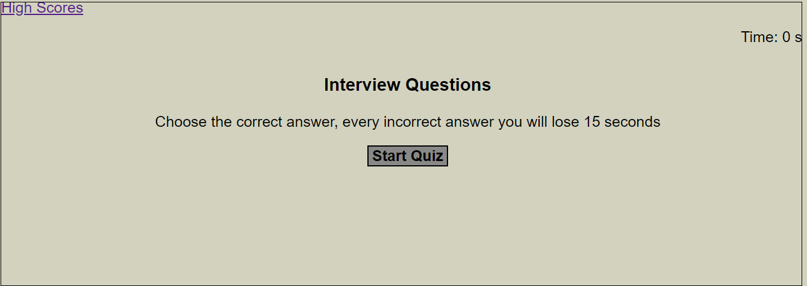

# Interview-Quiz

## Description

```
This application is a timed coding quiz with multiple-choice questions. This app runs in the browser and featured dynamically using HTML and CSS powered by JavaScript code.

```

## User Story

```
AS A coding boot camp student
I WANT to take a timed quiz on JavaScript fundamentals that stores high scores
SO THAT I can gauge my progress compared to my peers
```

## Acceptance Criteria

```
GIVEN I am taking a code quiz
WHEN I click the start button
THEN a timer starts and I am presented with a question
WHEN I answer a question
THEN I am presented with another question
WHEN I answer a question incorrectly
THEN time is subtracted from the clock
WHEN all questions are answered or the timer reaches 0
THEN the game is over
WHEN the game is over
THEN I can save my initials and my score
WHEN I saved my initials and my score
Then I can see my progress compared to my peers
```

## Mock-Up

The following are the images of this functionality:



